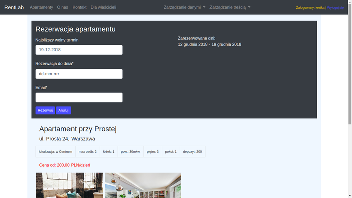

# Rentystem 
is a short term www rental system for appartments.

It is my first Python/Django project after I finished python bootcamp.
It still needs couple of corrections :)

Home page: 

The purpose of the application is to enable customers to book an appartment in a given city.

The appartments may belong to different people - the system registers each owner and all his/hers appartments.
The customer may search for an apartment in a given city.
System checks booking dates and shows the first available date that can be booked.
It also shows all dates that have already been booked. 

The superuser may add, delete, modify, edit appartments and owners as well as the content of the site 
(About - O nas, Contact - Kontakt, For Owners - Dla Właścicieli)

The photos to each appartment can also be added by editing each appartment. 

I will be grateful for any constructive comment :)

Katarzyna Nyczka

November, 2018

